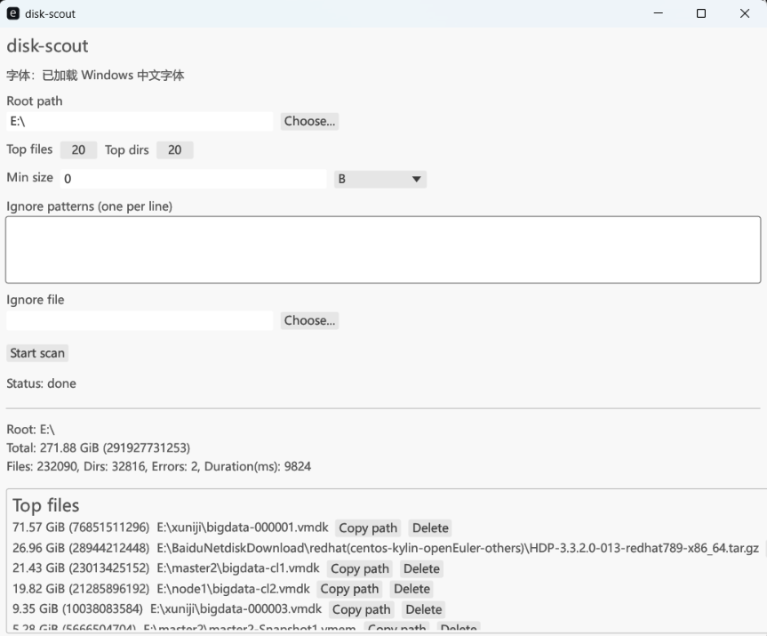

# disk-scout

可靠、可验证的磁盘空间定位工具：对指定目录进行只读扫描，输出占用空间最大的文件与目录列表。Windows 提供 GUI 以完成“定位 + 处置”的闭环，Linux/macOS 继续使用 CLI。

[](https://github.com/zhangyongtian/disk-scout/actions/workflows/ci.yml)
[](https://github.com/zhangyongtian/disk-scout/actions/workflows/release.yml)

## 截图



本仓库采用“仓库根目录 + 子目录工程”的结构，Rust 项目位于 `disk-scout/` 目录下。

## 快速开始

Windows（PowerShell）：

```powershell
cd disk-scout
.\disk-scout.exe --help
.\disk-scout.exe scan "C:\Users\%USERNAME%\Downloads"
.\disk-scout-gui.exe
```

Linux/macOS：

```bash
cd disk-scout
./disk-scout --help
./disk-scout scan ~/Downloads
```

## 文档

完整使用说明（CLI 参数、GUI 交互、安全删除模型、ignore/min-size 语法、输出格式与 Release 流程）见：

- [disk-scout/README.md](disk-scout/README.md)
